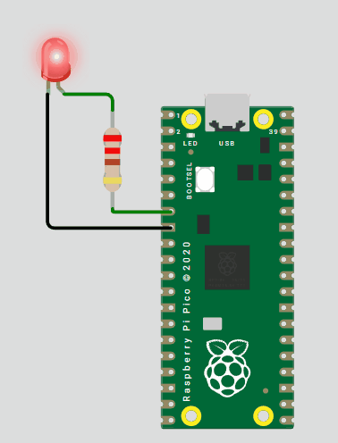

# 💡 Blink LED - Raspberry Pi Pico en Wokwi

> **Ejemplo básico:** Control de LED utilizando GPIO en MicroPython

## 📋 Descripción

Este proyecto demuestra cómo controlar un LED conectado al pin GPIO de la Raspberry Pi Pico utilizando MicroPython en el simulador Wokwi. El LED parpadea de manera continua con intervalos de 1 segundo.

## 🚀 Instrucciones de Uso

### Paso 1: Configuración en Wokwi
1. Abre la plantilla de Wokwi donde ya esta el proyecto seteado [Wokwi](https://wokwi.com/projects/433233098204358657)
2. Carga los siguientes archivos en tu proyecto:
   - **`main.py`** → Código principal en MicroPython
   - **`diagram.json`** → Configuración del circuito

### Paso 2: Componentes del Proyecto
| Archivo | Descripción |
|---------|-------------|
| `main.py` | Código MicroPython para controlar el parpadeo del LED |
| `diagram.json` | Diagrama de conexión del LED al pin **GP5** |

### Paso 3: Conexión del Circuito
- **LED** conectado al pin **GP5** de la Raspberry Pi Pico
- **Resistencia** de 220Ω para limitar la corriente
- **GND** conectado al pin de tierra

## 🎯 Resultado Esperado

El LED parpadeará automáticamente con la siguiente secuencia:
- ⚡ **Encendido:** 1 segundo
- 🔄 **Apagado:** 1 segundo
- 🔁 **Repetición:** Infinita

### 📺 Simulación en Acción

  
   
  <em>LED parpadeando conectado al pin GP5</em>

## 🔧 Requisitos Técnicos

- **Plataforma:** Wokwi Simulator
- **Microcontrolador:** Raspberry Pi Pico
- **Lenguaje:** MicroPython
- **Pin utilizado:** GP5

## 📚 Conceptos Aplicados

- Control de pines GPIO
- Temporización con `time.sleep()`
- Bucles infinitos en MicroPython
- Configuración de pines como salida digital

---