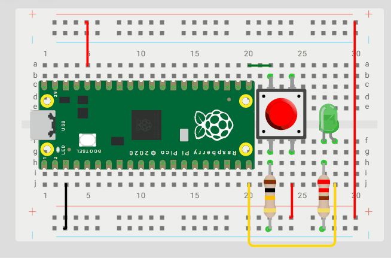

# 🔘 LED con Botón - Raspberry Pi Pico en Wokwi

> **Ejemplo interactivo:** Control de LED mediante botón pulsador utilizando GPIO en MicroPython

## 📋 Descripción

Este proyecto demuestra cómo controlar un LED mediante un botón pulsador conectado a los pines GPIO de la Raspberry Pi Pico utilizando MicroPython en el simulador Wokwi. El LED se enciende únicamente cuando el botón está presionado y se apaga al soltarlo.

## 🚀 Instrucciones de Uso

### Paso 1: Configuración en Wokwi
1. Abre la plantilla de Wokwi donde ya está el proyecto configurado
2. Carga los siguientes archivos en tu proyecto:
   - **`main.py`** → Código principal en MicroPython
   - **`diagram.json`** → Configuración del circuito

### Paso 2: Componentes del Proyecto
| Archivo | Descripción |
|---------|-------------|
| `main.py` | Código MicroPython para controlar el LED con botón |
| `diagram.json` | Circuito: LED verde (GP15) + botón rojo (GP16) con resistencias pull-down externa |

### Paso 3: Conexión del Circuito
- **LED Verde** conectado al pin **GP15** de la Raspberry Pi Pico
- **Resistencia R2** de 220Ω para limitar la corriente del LED (conectada entre LED y GND)
- **Botón pulsador rojo** conectado al pin **GP16**
- **Resistencia R1** de 10kΩ como pull-down externa para el botón
- **Alimentación** de 3.3V para el botón desde el pin 3V3
- **GND** conectado a los pines de tierra correspondientes

## 🎯 Resultado Esperado

El sistema responderá de la siguiente manera:
- 🔘 **Botón presionado:** LED encendido
- ⚫ **Botón liberado:** LED apagado
- ⚡ **Respuesta:** Inmediata al cambio de estado
- 🔄 **Funcionamiento:** Continuo

### 📺 Simulación en Acción

  
   
  <em>LED verde controlado por botón rojo - GP15 (LED) y GP16 (Botón)</em>

## 🔧 Requisitos Técnicos

- **Plataforma:** Wokwi Simulator
- **Microcontrolador:** Raspberry Pi Pico
- **Lenguaje:** MicroPython
- **Pines utilizados:** 
  - GP15 (LED Verde - Salida)
  - GP16 (Botón Rojo - Entrada)
- **Componentes:**
  - LED verde con resistencia 220Ω
  - Botón pulsador rojo con pull-down 10kΩ

## 📚 Conceptos Aplicados

- Control de pines GPIO como entrada y salida
- Configuración de resistencia pull-down externa (10kΩ)
- Lectura de estado digital de botón pulsador
- Control de salida digital para LED
- Bucles infinitos con verificación de estado
- Debounce básico con `sleep(0.1)`